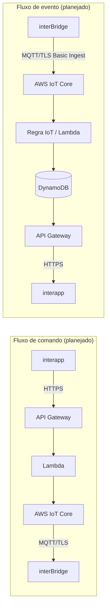
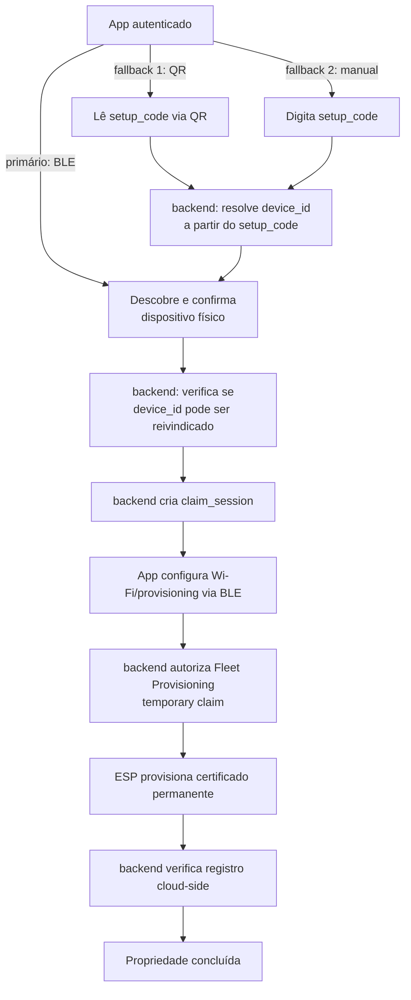

# Arquitetura

Este documento descreve a arquitetura planejada do backend `InterBridge` e
deixa explícito o que já existe (Fases 1A/1B.1/1B.2/1B.3/1C), o que está
**declarado no CDK mas ainda não implantado**, e o que ainda é apenas
desenho. Ver também `docs/adr/0001-ble-first-onboarding.md` para a decisão
arquitetural do onboarding BLE-first e `docs/data-model.md` para o desenho
completo das tabelas DynamoDB da Fase 1C.

## Visão geral

```text
interapp (Flutter)
   │  HTTPS
   ▼
API Gateway (HTTP API)
   │
   ▼
Lambda
   │
   ▼
AWS IoT Core (broker MQTT/TLS)
   │  MQTT/TLS + certificado X.509 individual
   ▼
interBridge (firmware ESP32)
```

O aplicativo (`interapp`) **nunca** se conecta diretamente ao broker MQTT.
Toda comunicação entre app e dispositivo passa pelo backend.

## Fluxo de retorno (eventos do dispositivo)

```text
interBridge (firmware ESP32)
   │  MQTT/TLS, AWS IoT Basic Ingest (quando aplicável)
   ▼
AWS IoT Core → Regra de IoT (Basic Ingest)
   │
   ▼
Lambda de processamento
   │
   ▼
DynamoDB (estado, histórico, idempotência)
   │
   ▼
API Gateway → HTTPS
   │
   ▼
interapp (Flutter)
```

## Diagrama (Mermaid)



## O que já existe vs. o que é apenas planejado

| Camada | Declarado no CDK (código) | Implantado na AWS | Planejado (fases futuras) |
| --- | --- | --- | --- |
| `DataStack` | **Quatro tabelas DynamoDB** (`Devices`, `SetupCodeLookups`, `DeviceMemberships`, `ClaimSessions` — Fase 1C, ver `docs/data-model.md`) | **Sim (Fase 1C, 2026-08-13)** — `InterBridge-Dev-DataStack` em `CREATE_COMPLETE`, `dev`/`sa-east-1`, quatro tabelas `ACTIVE` e vazias | Lambdas consumidoras, roles IAM de privilégio mínimo, pepper do HMAC (Secrets Manager) |
| `IoTStack` | **Thing Type, Thing Group, IoT Policy compartilhada de privilégio mínimo, endurecida com `IsAttached`** (Fase 1B.1/1B.2) | **Sim (Fase 1B.3)** — `CDKToolkit` e `InterBridge-Dev-IoTStack` em `CREATE_COMPLETE`, `dev`/`sa-east-1` | Regras de Basic Ingest (nomes já reservados em `infrastructure/config/iot.py`), Things individuais e certificados (fora do Git, Fase 1D), integração com as tabelas da `DataStack` (Fase 1E) |
| `ApiStack` | Classe da stack, tags, nenhum endpoint | Não | API Gateway HTTP API, Lambdas, autenticação, endpoints usados pelo `interapp` |
| `ObservabilityStack` | Classe da stack, tags, nenhum dashboard/alarme | Não | Dashboard CloudWatch pequeno, alarmes de erro/throttling |
| Certificados de dispositivo | Não declarados (nunca em código) | Não | Emitidos via Fleet Provisioning (Fase 1D), nunca commitados |

**`IoTStack` (Fase 1B.3) e `DataStack` (Fase 1C) estão implantadas na
AWS.** `ApiStack` e `ObservabilityStack` continuam apenas como o que
`cdk synth` produz localmente — nenhum recurso declarado nelas ainda. As
quatro tabelas da `DataStack` estão vazias: nenhum código roda contra
elas, e o app/firmware **nunca** acessam o DynamoDB diretamente — apenas
uma futura API (Fase 2/3) o fará, nunca o cliente diretamente. Ver
`CONTEXT.md` para o estado atual detalhado e `docs/phases.md` para as
fases planejadas.

### Detalhe: `DataStack` na Fase 1C — quatro camadas distintas

É importante não confundir quatro coisas diferentes quando se fala da
Fase 1C:

1. **Infraestrutura declarada e implantada**: as quatro tabelas DynamoDB
   em si (`infrastructure/stacks/data_stack.py`) — isso existe de fato em
   `dev`/`sa-east-1` desde 2026-08-13, mas **vazio** (sem itens).
2. **Modelos de domínio implementados localmente**: `domain/devices`,
   `domain/claims`, `domain/ownership` — código Python puro (`Device`,
   `ClaimSession`, `DeviceMembership`, o algoritmo HMAC do `setup_code`
   etc.), testado, mas que **não roda em lugar nenhum da AWS** — não há
   Lambda nem qualquer outro runtime que os importe ainda.
3. **Serviços em runtime**: **não implementados**. Não existe API,
   Lambda, ou processo algum que leia ou escreva nas quatro tabelas.
4. **Componentes futuros**: pepper do HMAC (Secrets Manager), roles IAM
   de privilégio mínimo, a transação atômica de conclusão de claim — tudo
   documentado em `docs/data-model.md`, nada criado.

Ver `docs/data-model.md` para o desenho completo das tabelas.

### Detalhe: `IoTStack` na Fase 1B.1/1B.2

A IoT Policy compartilhada não identifica um dispositivo específico — ela
usa a variável de policy do AWS IoT `${iot:Connection.Thing.ThingName}`,
resolvida pela AWS IoT Core no momento da conexão a partir do Thing
associado ao certificado em uso. Isso garante que, quando dispositivos
individuais existirem (Fase 1D), cada um só possa:

1. Conectar usando como MQTT Client ID o nome do próprio Thing — e apenas
   se o certificado estiver de fato anexado a esse Thing (condição
   `iot:Connection.Thing.IsAttached: true`, endurecimento da Fase 1B.2,
   repetida em todas as quatro statements da policy).
2. Assinar e receber comandos apenas em `interbridge/{seu-thing}/commands`.
3. Publicar eventos, health e respostas apenas nos caminhos de Basic Ingest
   do próprio dispositivo (`$aws/rules/{regra}/interbridge/{seu-thing}/...`).

Ver o documento da policy completo em `infrastructure/stacks/iot_stack.py`
e os testes semânticos em `tests/unit/test_iot_stack.py`.

### Onboarding BLE-first (Fase 1B.2 — arquitetura, não implementado)

A partir da Fase 1B.2, a arquitetura planejada para reivindicação de
dispositivo (*device claim*) passa a ser **BLE-first**, com QR code e
digitação manual como fallbacks equivalentes entre si:



Detalhes completos, terminologia (`setup_code`, `claim_session`, Fleet
Provisioning temporary claim), alternativas consideradas e decisões em
aberto estão em `docs/adr/0001-ble-first-onboarding.md` e em `CONTEXT.md`
(seção "Onboarding BLE-first"). **Nada neste diagrama está implementado**
— é a arquitetura-alvo para a Fase 3.

**Nota sobre a fonte oficial do protocolo:** a versão atualmente vigente
de `interBridge/docs/communication-protocol.md` (Draft v1.2) ainda
descreve o fluxo antigo (QR obrigatório com `claim_code`). A arquitetura
BLE-first acima é uma decisão deste backend, antecipando a direção de
produto — não deve ser lida como um contrato já ratificado pelo firmware
até uma revisão futura do protocolo oficial confirmar os novos termos.

## Dependências entre stacks (para evitar dependências circulares)

```text
DataStack  ──┬──>  IoTStack
             └──>  ApiStack

DataStack, IoTStack, ApiStack  ──>  ObservabilityStack
```

- `IoTStack` e `ApiStack` dependerão de recursos exportados por `DataStack`
  (ex.: ARNs de tabelas), nunca o contrário.
- `IoTStack` não deve depender de `ApiStack`, e vice-versa, para evitar um
  ciclo entre "comandos enviados pela API" e "eventos ingeridos pelo IoT".
- `ObservabilityStack` apenas observa métricas das outras stacks; nenhuma
  stack deve depender dela.

## Protocolo de comunicação

O contrato exato entre `interBridge` e o backend é definido em
`interBridge/docs/communication-protocol.md` (fonte oficial). Um resumo é
mantido em `CONTEXT.md` deste repositório apenas para orientação rápida —
esse resumo não deve ser tratado como fonte de verdade.
