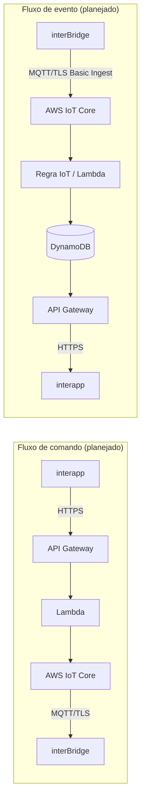

# Arquitetura

Este documento descreve a arquitetura planejada do backend `InterBridge` e
deixa explícito o que já existe (Fases 1A/1B), o que está **declarado no
CDK mas ainda não implantado**, e o que ainda é apenas desenho.

## Visão geral

```text
interapp (Flutter)
   │  HTTPS
   ▼
API Gateway (HTTP API)
   │
   ▼
Lambda
   │
   ▼
AWS IoT Core (broker MQTT/TLS)
   │  MQTT/TLS + certificado X.509 individual
   ▼
interBridge (firmware ESP32)
```

O aplicativo (`interapp`) **nunca** se conecta diretamente ao broker MQTT.
Toda comunicação entre app e dispositivo passa pelo backend.

## Fluxo de retorno (eventos do dispositivo)

```text
interBridge (firmware ESP32)
   │  MQTT/TLS, AWS IoT Basic Ingest (quando aplicável)
   ▼
AWS IoT Core → Regra de IoT (Basic Ingest)
   │
   ▼
Lambda de processamento
   │
   ▼
DynamoDB (estado, histórico, idempotência)
   │
   ▼
API Gateway → HTTPS
   │
   ▼
interapp (Flutter)
```

## Diagrama (Mermaid)



## O que já existe vs. o que é apenas planejado

| Camada | Declarado no CDK (código) | Implantado na AWS | Planejado (fases futuras) |
| --- | --- | --- | --- |
| `DataStack` | Classe da stack, tags, nenhuma tabela DynamoDB | Não | Modelo de tabelas (dispositivos, vínculo usuário-dispositivo, status, idempotência, histórico) |
| `IoTStack` | **Thing Type, Thing Group, IoT Policy compartilhada de privilégio mínimo** (Fase 1B) | **Não** — nada foi implantado; `cdk bootstrap`/`cdk deploy` não foram executados | Regras de Basic Ingest (nomes já reservados em `infrastructure/config/iot.py`), Things individuais e certificados (fora do Git, Fase 1C), integração com Lambda/DynamoDB |
| `ApiStack` | Classe da stack, tags, nenhum endpoint | Não | API Gateway HTTP API, Lambdas, autenticação, endpoints usados pelo `interapp` |
| `ObservabilityStack` | Classe da stack, tags, nenhum dashboard/alarme | Não | Dashboard CloudWatch pequeno, alarmes de erro/throttling |
| Certificados de dispositivo | Não declarados (nunca em código) | Não | Emitidos via Fleet Provisioning (Fase 1C), nunca commitados |

**Nenhum recurso AWS real foi implantado ainda em nenhuma fase.** A coluna
"Declarado no CDK" descreve apenas o que `cdk synth` produz localmente. Ver
`CONTEXT.md` para o estado atual detalhado e `docs/phases.md` para as fases
planejadas.

### Detalhe: `IoTStack` na Fase 1B

A IoT Policy compartilhada não identifica um dispositivo específico — ela
usa a variável de policy do AWS IoT `${iot:Connection.Thing.ThingName}`,
resolvida pela AWS IoT Core no momento da conexão a partir do Thing
associado ao certificado em uso. Isso garante que, quando dispositivos
individuais existirem (Fase 1C), cada um só possa:

1. Conectar usando como MQTT Client ID o nome do próprio Thing.
2. Assinar e receber comandos apenas em `interbridge/{seu-thing}/commands`.
3. Publicar eventos, health e respostas apenas nos caminhos de Basic Ingest
   do próprio dispositivo (`$aws/rules/{regra}/interbridge/{seu-thing}/...`).

Ver o documento da policy completo em `infrastructure/stacks/iot_stack.py`
e os testes semânticos em `tests/unit/test_iot_stack.py`.

## Dependências entre stacks (para evitar dependências circulares)

```text
DataStack  ──┬──>  IoTStack
             └──>  ApiStack

DataStack, IoTStack, ApiStack  ──>  ObservabilityStack
```

- `IoTStack` e `ApiStack` dependerão de recursos exportados por `DataStack`
  (ex.: ARNs de tabelas), nunca o contrário.
- `IoTStack` não deve depender de `ApiStack`, e vice-versa, para evitar um
  ciclo entre "comandos enviados pela API" e "eventos ingeridos pelo IoT".
- `ObservabilityStack` apenas observa métricas das outras stacks; nenhuma
  stack deve depender dela.

## Protocolo de comunicação

O contrato exato entre `interBridge` e o backend é definido em
`interBridge/docs/communication-protocol.md` (fonte oficial). Um resumo é
mantido em `CONTEXT.md` deste repositório apenas para orientação rápida —
esse resumo não deve ser tratado como fonte de verdade.
