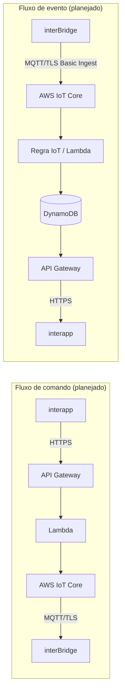

# Arquitetura

Este documento descreve a arquitetura planejada do backend `InterBridge` e
deixa explícito o que já existe nesta fase (Fase 1A) e o que ainda é apenas
desenho.

## Visão geral

```text
interapp (Flutter)
   │  HTTPS
   ▼
API Gateway (HTTP API)
   │
   ▼
Lambda
   │
   ▼
AWS IoT Core (broker MQTT/TLS)
   │  MQTT/TLS + certificado X.509 individual
   ▼
interBridge (firmware ESP32)
```

O aplicativo (`interapp`) **nunca** se conecta diretamente ao broker MQTT.
Toda comunicação entre app e dispositivo passa pelo backend.

## Fluxo de retorno (eventos do dispositivo)

```text
interBridge (firmware ESP32)
   │  MQTT/TLS, AWS IoT Basic Ingest (quando aplicável)
   ▼
AWS IoT Core → Regra de IoT (Basic Ingest)
   │
   ▼
Lambda de processamento
   │
   ▼
DynamoDB (estado, histórico, idempotência)
   │
   ▼
API Gateway → HTTPS
   │
   ▼
interapp (Flutter)
```

## Diagrama (Mermaid)



## O que já existe (Fase 1A) vs. o que é apenas planejado

| Camada | Fase 1A (implementado) | Planejado (fases futuras) |
| --- | --- | --- |
| `DataStack` | Classe da stack, tags, nenhuma tabela DynamoDB | Modelo de tabelas (dispositivos, vínculo usuário-dispositivo, status, idempotência, histórico) |
| `IoTStack` | Classe da stack, tags, nenhum recurso de IoT Core | Policies de IoT, regras de Basic Ingest, integração com Lambda/DynamoDB |
| `ApiStack` | Classe da stack, tags, nenhum endpoint | API Gateway HTTP API, Lambdas, autenticação, endpoints usados pelo `interapp` |
| `ObservabilityStack` | Classe da stack, tags, nenhum dashboard/alarme | Dashboard CloudWatch pequeno, alarmes de erro/throttling |
| Certificados de dispositivo | Não gerados nesta fase | Emitidos via Fleet Provisioning (fase futura), nunca commitados |

Nenhum recurso AWS real foi implantado nesta fase. Ver `CONTEXT.md` para o
estado atual detalhado e `docs/phases.md` para as fases planejadas.

## Dependências entre stacks (para evitar dependências circulares)

```text
DataStack  ──┬──>  IoTStack
             └──>  ApiStack

DataStack, IoTStack, ApiStack  ──>  ObservabilityStack
```

- `IoTStack` e `ApiStack` dependerão de recursos exportados por `DataStack`
  (ex.: ARNs de tabelas), nunca o contrário.
- `IoTStack` não deve depender de `ApiStack`, e vice-versa, para evitar um
  ciclo entre "comandos enviados pela API" e "eventos ingeridos pelo IoT".
- `ObservabilityStack` apenas observa métricas das outras stacks; nenhuma
  stack deve depender dela.

## Protocolo de comunicação

O contrato exato entre `interBridge` e o backend é definido em
`interBridge/docs/communication-protocol.md` (fonte oficial). Um resumo é
mantido em `CONTEXT.md` deste repositório apenas para orientação rápida —
esse resumo não deve ser tratado como fonte de verdade.
