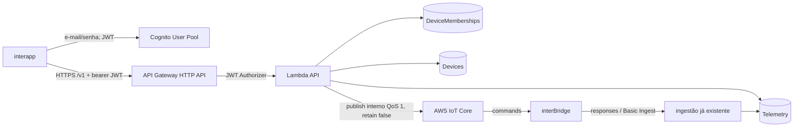

# Fase 2 — arquitetura, contratos e segurança

> **Estado:** a Fase 2A foi concluída e a Fase 2B/2D implementam Cognito, HTTP API, JWT
> Authorizer, os três GETs, o registro administrativo e as duas rotas assíncronas de comando. Esta
> revisão acrescenta `PATCH /v1/devices/{device_id}` (definir/limpar `display_name`) na mesma API
> A Fase 2D de comandos está concluída e encerrada. O PATCH pertence à Fase 3. Sua primeira chamada
> falhou no cold start e não escreveu `display_name`; após hotfix, deploy `UPDATE_COMPLETE` e novo
> teste, o app Android salvou `Casa` e confirmou a persistência. Fluxo validado ponta a ponta em DEV.

A fonte de verdade dispositivo↔nuvem continua sendo
`interBridge/docs/communication-protocol.md` (Draft v1.2, conforme a referência versionada no backend). Este documento
referencia somente os elementos necessários ao contrato HTTP; não replica nem redefine o
protocolo. Se houver divergência, o firmware prevalece e o contrato HTTP deve ser revisto.

## Limites e componentes planejados

Somente DEV/`sa-east-1` é alvo inicial. O app não acessa MQTT/DynamoDB nem recebe credenciais AWS.
A HTTP API com JWT Authorizer é escolhida conforme o ADR 0003. REST API não é necessária hoje.

## Fluxos

### Autenticação

1. O app realiza sign-up/sign-in futuro no User Pool por e-mail e senha; confirmação de e-mail usa
   código e recuperação de senha é habilitada.
2. O app envia o access token como bearer JWT para `/v1`; nunca envia `sub` separadamente.
3. O authorizer valida assinatura, algoritmo, issuer, audience/client ID e validade temporal;
   audience não basta para distinguir ID token de access token sem scopes.
4. A Lambda exige `token_use=access` e `client_id` igual ao app client esperado, então usa
   exclusivamente `sub` como `user_id`. ID token falha com 401.
5. Logout remove tokens locais e solicita revogação quando disponível; token emitido pode valer até
   sua expiração, portanto membership é sempre revalidada.

### Autorização e antienumeração

1. Validar JWT e formato do path.
2. Fazer leitura pontual da membership `(device_id, sub)`; somente `ACTIVE` continua.
3. Se membership não existe/inativa, responder exatamente `404 RESOURCE_NOT_FOUND`, sem consultar
   ou revelar o Device. Dispositivo inexistente usa a mesma resposta.
4. Depois disso, buscar Device/telemetria e aplicar a permissão do papel. Papel conhecido mas sem
   permissão retorna `403 ACCESS_DENIED`; isso não revela existência a quem não tinha membership.
5. Para comando, vincular `command_id` ao `device_id` da URL em toda consulta.

`GET /v1/devices` é a exceção natural: consulta o GSI existente por `user_id = sub`, filtra/retorna
somente `ACTIVE`, nunca usa Scan e nunca aceita identidade do cliente. Resultados recentemente
alterados podem refletir consistência eventual do GSI, mas cada rota de detalhe revalida a chave
base antes de autorizar.

## Matriz rota × papel

Os papéis abaixo são os enums existentes. `OWNER` é suportado inicialmente; habilitar comandos
para `ADMIN`/`MEMBER` exige política explícita na 2B. Qualquer membership não `ACTIVE` equivale a
sem acesso.

| Rota | OWNER ativo | ADMIN ativo | MEMBER ativo |
| --- | --- | --- | --- |
| `GET /v1/devices` | listar própria membership | listar, leitura futura | listar, leitura futura |
| `GET /v1/devices/{device_id}` | permitido | permitido para leitura | permitido para leitura |
| `PATCH /v1/devices/{device_id}` (display_name próprio) | permitido | permitido | permitido |
| `GET /v1/devices/{device_id}/status` | permitido | permitido para leitura | permitido para leitura |
| `POST /v1/devices/{device_id}/commands` | comandos permitidos pelo protocolo/política | negado até decisão 2B | negado até decisão 2B |
| `GET /v1/devices/{device_id}/commands/{command_id}` | permitido | permitido para leitura | permitido para leitura |

Ownership de produto não concede ao usuário o certificado IoT; IoT Policy e attachment continuam
controlando o ESP independentemente.

## Contratos `/v1`

`docs/openapi-v1.yaml` é o contrato validável aprovado para implementação futura. Todas as rotas
exigem bearer JWT. Respostas usam JSON, timestamps públicos HTTP em RFC 3339 UTC e cursor opaco.
O envelope de erro estável é `{"error":{"code","message","request_id"}}`; mensagens são
sanitizadas. Limite padrão de lista: 25, máximo 100. Payload HTTP máximo de comando: 4 KiB; o
payload MQTT construído deve respeitar também o máximo oficial de 8 KiB. Rate limits finais serão
configurados na 2B e nunca prometidos como quota de segurança absoluta.

### `GET /v1/devices`

Lista o schema mínimo `device_id`, `display_name` opcional, `role` e `status`. `limit` vale 1–100 e
`cursor` é opaco, cifrado/autenticado pelo AWS KMS e vinculado ao `sub` e `limit` via Encryption
Context; não expõe `LastEvaluatedKey`. Usa Query no índice por usuário, sem Scan, e remove
memberships não ativas. BatchGet repete UnprocessedKeys no máximo três vezes com exponential
backoff e jitter; esgotamento falha sanitizado, sem aguardar timeout da Lambda.
É idempotente, mas paginação e GSI são eventualmente consistentes. Retorna `200`, `400`, `401`,
`429`, `500` ou `503`; lista vazia é `200`.

### `GET /v1/devices/{device_id}`

Valida `device_id`, exige membership ativa e retorna somente `device_id`, metadados públicos
mínimos (`display_name`, `hardware_version`, `ownership_status`, `provisioning_status`,
`created_at`, `updated_at` quando já presentes no item) e `role`.
Nunca expõe setup code/digest, Thing ARN/nome interno, certificate ID ou detalhes AWS. É idempotente.
Formato inválido gera `400 INVALID_DEVICE_ID`; inexistente ou sem membership gera o mesmo
`404 RESOURCE_NOT_FOUND`. Leituras autorizativas devem ser fortes quando necessário; metadados
podem ter consistência eventual documentada na implementação.

### `PATCH /v1/devices/{device_id}` (display_name)

Define ou limpa `display_name`, o apelido pessoal na `DeviceMembership` do usuário autenticado.
Usuários podem ver nomes diferentes para o mesmo InterBridge. Qualquer `OWNER`, `ADMIN` ou `MEMBER`
com membership `ACTIVE` pode alterar somente o próprio nome; `user_id` vem exclusivamente do JWT.
Não existe campo de cômodo/ambiente. O corpo exige o campo
`display_name` (nunca omitido): uma string é validada (removidos os espaços externos, rejeitada se
vazia após a remoção ou maior que 60 caracteres) e `null` limpa o nome. A escrita usa
`UpdateItem` atômico em `DeviceMemberships`, na chave `device_id` + `user_id`, com condição de
existência e `status = ACTIVE`; falha retorna `404 RESOURCE_NOT_FOUND` sem enumeração. Somente o
`updated_at` da membership muda; `Devices` não recebe `UpdateItem`. A resposta `200` compõe os
dados seguros de `Device` com o apelido atualizado da membership. `display_name`
nunca é usado para autorização, chave, tópico MQTT ou identidade; um valor `null`/ausente significa
que o app deve exibir seu próprio rótulo local (ex.: "InterBridge"), nunca persistido pelo backend.

### `GET /v1/devices/{device_id}/status`

Após membership ativa, lê a chave exata `STATE#CURRENT` na tabela separada de telemetria. Sem health
retorna `200` com `health: null`, `connectivity: UNKNOWN`, `freshness: UNKNOWN`; não retorna 404.
Quando existe health, separa `intercom_state` funcional de conectividade inferida. Proposta DEV,
não SLA/contrato definitivo de produção: `FRESH` quando idade de `last_seen_at` ≤ 120 s e `STALE`
quando maior; `connectivity` pode ser `RECENTLY_SEEN`, `STALE` ou `UNKNOWN`, jamais “online” por
mera existência de registro antigo. Retorna também `last_seen_at`, sem RSSI/heap por padrão. É GET
idempotente, refletindo ingestão assíncrona/eventualmente consistente.

### `POST /v1/devices/{device_id}/commands`

Após membership e papel, aceita apenas `command` e parâmetros próprios do comando. Não aceita
`command_id`, timestamps, tópico MQTT, `user_id` ou campos desconhecidos. O conjunto e schema são
validados contra o protocolo oficial vigente; `ENTER_PROVISIONING` e `FACTORY_RESET` não podem ser
remotos. O backend gera CSPRNG `command_id` de 32 hex minúsculos e define `issued_at`/`expires_at`
em epoch seconds no MQTT; constrói internamente `interbridge/{device_id}/commands`, publica QoS 1,
`retain=false` e nunca aceita tópico do cliente.

A resposta `202` contém `command_id`, estado público `PENDING`, `issued_at` e `expires_at` em RFC
3339. Aceitação/publicação não significa execução. A futura implementação deve persistir uma
intenção antes/do modo idempotente em relação ao publish e limitar por `sub`, dispositivo, IP e
janela, com burst baixo, cooldown e alarme de abuso. O cliente pode enviar `Idempotency-Key`
opaco (1–128 caracteres): mesma chave + mesmo `sub`/dispositivo/corpo dentro da janela retorna o
mesmo resultado; mesma chave com corpo diferente retorna `409 IDEMPOTENCY_CONFLICT`. Sem chave,
retries podem criar outro comando. Chaves expiram após janela a definir na 2B. Nenhum comando ou
ação física é implementado na 2A.

### `GET /v1/devices/{device_id}/commands/{command_id}`

Primeiro valida membership do dispositivo; depois procura somente a resposta/intenção associada à
chave composta daquele mesmo `device_id`. Um ID de outro dispositivo não é consultável. Sem
intenção/resposta conhecida retorna `404 COMMAND_NOT_FOUND` somente para membro autorizado. Uma
intenção conhecida sem response retorna `200 PENDING`; após `expires_at`, `EXPIRED`. As respostas
do protocolo mapeiam `COMPLETED` → `COMPLETED`; `FAILED`/`REJECTED` → `REJECTED`; `ACCEPTED` sem
terminal → `PENDING`. Esse mapeamento não altera o status MQTT original, que pode ser preservado
internamente. MQTT, Basic Ingest e DynamoDB são assíncronos: polling pode observar atraso e
consistência eventual. GET é idempotente.

## Taxonomia HTTP

| HTTP | Código | Uso |
| --- | --- | --- |
| 400 | `INVALID_REQUEST`, `INVALID_DEVICE_ID`, `INVALID_COMMAND` | sintaxe/schema/limites |
| 401 | `UNAUTHENTICATED` | JWT ausente ou inválido |
| 403 | `ACCESS_DENIED` | membership ativa, papel sem ação permitida |
| 404 | `RESOURCE_NOT_FOUND` | inexistente **ou** sem membership (antienumeração) |
| 404 | `COMMAND_NOT_FOUND` | membro ativo, comando ausente neste dispositivo |
| 409 | `IDEMPOTENCY_CONFLICT` | chave repetida com requisição diferente |
| 429 | `RATE_LIMITED` | proteção contra abuso; pode incluir `Retry-After` |
| 500 | `INTERNAL_ERROR` | falha interna sanitizada |
| 503 | `SERVICE_UNAVAILABLE` | dependência temporariamente indisponível |

## Registro administrativo controlado do dispositivo DEV (desenho)

Não é endpoint público e não será implementado na 2A. Na 2B, uma ferramenta/operacão interna
separada deverá:

1. Exigir credenciais de operator AWS explícitas, de curta duração, identidade auditável, região
   `sa-east-1`, `--environment dev` e confirmação digitada específica; negar produção e credenciais
   de longa duração.
2. Receber somente o `sub` de usuário Cognito já criado, `device_id`/Thing DEV validado e os
   metadados mínimos obrigatórios do `Device`; não aceitar e-mail como owner.
3. Fazer leituras de validação: usuário existe, formato `ib-<32hex>`, Thing existe, nome coincide
   com `device_id` e vínculos DEV esperados estão íntegros.
4. Executar `TransactWriteItems`: `Device` legítimo + `DeviceMembership OWNER/ACTIVE` + marcador de
   OWNER único, com condições de ausência ou igualdade integral para retry idempotente. Conflito de
   ownership/metadados aborta tudo; nunca sobrescreve silenciosamente.
5. Não criar `SetupCodeLookup`/`ClaimSession`, não simular BLE, claim ou Fleet Provisioning e não
   tocar certificado/chave.
6. Auditar somente actor, ambiente, request/correlation ID, hashes/identificadores sanitizados,
   resultado e horário; nunca token, código, setup code, certificado ou segredo.

Remoção futura será outra operação revisada: confirmar DEV/actor/identificadores, verificar ausência
de dependências/comandos ativos, transacionar membership para `REMOVED` e atualizar ownership por
uma máquina de estados definida (não apagar história silenciosamente), produzir auditoria
sanitizada e tratar a limpeza do Thing/certificado por runbook IoT separado. Rollback não cria
setup/claim falso. A implementação, IAM exato, marker de OWNER e política de retenção exigem revisão
separada na 2B.

## Threat model enxuto

| Ameaça/falha | Controle planejado |
| --- | --- |
| Token roubado | TLS, armazenamento seguro no app, access token curto, logout/revogação; membership por request |
| Token expirado/issuer-audience-algoritmo errado | JWT Authorizer rejeita antes da Lambda |
| `device_id` alterado na URL / enumeração | validação + lookup de membership; `404` uniforme |
| Membership revogada | checagem `ACTIVE` por request, falha fechada; não confiar no JWT para papel |
| Abuso/rate limiting | limites por usuário/IP/dispositivo, throttling, cooldown e auditoria sanitizada |
| Replay/retry | `Idempotency-Key`, fingerprint do corpo, intenção persistida; validade curta no MQTT |
| `command_id` de outro dispositivo | lookup sempre composto/vinculado ao `device_id` autorizado |
| Injeção de tópico MQTT | tópico nunca é input; composição interna após validação estrita |
| Logs sensíveis | allowlist de campos, redaction e proibição de token/senha/códigos/payload bruto |
| Confundir e-mail e `sub` | identidade só do claim `sub`; e-mail nunca autoriza |
| Social futuro duplicado | vinculação explícita/verificada; não auto-unir apenas por e-mail |
| Cognito/API Gateway/Lambda indisponível | falha fechada, `503` sanitizado quando aplicável, retry com backoff |
| IoT Core/DynamoDB indisponível | não alegar execução, estado pendente/idempotente, `503`, retry seguro |

Risco residual: token válido roubado funciona até expirar ou até controles adicionais o bloquearem;
consistência eventual pode atrasar listagens/responses; diferenças laterais de timing exigirão teste
na 2B. Rate limiting reduz abuso, mas não substitui autorização.

## Custos e limites

HTTP API é preferida a REST API; Lambda e DynamoDB permanecem pay-per-use/on-demand. Não usar VPC,
NAT, cache provisionado ou authorizer Lambda quando o JWT Authorizer nativo bastar. Definir
retenção curta de logs, não registrar corpo/token, limitar paginação/payload/concurrency e evitar
métricas por dispositivo de alta cardinalidade. Alarmes adicionais e preços vigentes devem ser
revistos antes do deploy. Nenhum recurso/custo novo é criado pela 2A.

## Pendências para implementação

- Durações de access/refresh token, clock skew, fluxos OAuth exatos e testes de revogação.
- Permissões de comando de `ADMIN`/`MEMBER`, catálogo/parâmetros oficiais vigentes e TTL de comando.
- Rate/burst/cooldown, janela de idempotência e persistência da intenção `PENDING`.
- Critério de freshness calibrado com cadência real de health e UX do app.
- Estrutura transacional para OWNER único e procedimento aprovado de reversão DEV.
- CORS, domínios/stages, observabilidade, retenção e IAM mínimos da 2B.
- Vinculação segura de provedores sociais e MFA sem SMS, ambos fora desta fase.

## Fase 2D — concluída e encerrada

A API tinha exatamente cinco rotas JWT no escopo da Fase 2D: três leituras e POST/GET de comandos.
A Fase 3 acrescentou depois a sexta, `PATCH /v1/devices/{device_id}`, sem reabrir nem alterar o
desenho de comandos abaixo.
Somente o criador possui `iot:Publish`, restrito ao ARN `topic/interbridge/ib-*/commands`; o leitor
não possui ação IoT. A intenção, marcador de idempotência e cooldown usam transação na tabela
Telemetry existente, sem mudança de chaves ou replacement. Valores e consequências constam no
runbook da Fase 2D. A fase está encerrada; seus limites históricos sobre ação física permanecem.

### Correções pré-merge da Fase 2D

Após membership ACTIVE, o POST lê Devices consistentemente e só permite `OWNED` + `PROVISIONED`;
membership órfã, Device ausente, revogado ou decommissioned falham com o mesmo 404. A intenção usa
`PUBLISH_PENDING` antes do publish e `PUBLISHED` somente após confirmação do SDK. Retry normal de
`PUBLISHED` não republica; somente `PUBLISH_PENDING` ainda válido pode republicar o mesmo ID.
Respostas mantêm histórico e projeção direta `COMMAND_RESULT#<command_id>` pela ingestão.
